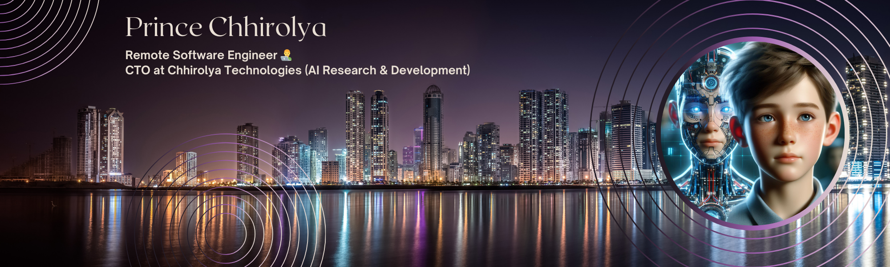
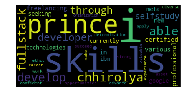

<h1 align="center"><i> Hello!, fellow < Programmers/ > I'm Prince👋 </i></h1>

_Hi! 👋, My name is **Prince Chhirolya** and I'm currently working remotely as a **Remote Software Engineer** from India 👨‍💻. I also work on my side project, **Chirolya Technologies** (AI Research & Development) ...🚀.
_

 

I am deeply passionate about leveraging technology to solve complex problems and drive innovation in the rapidly evolving landscape of software engineering. With a relentless drive for learning and growth, I continually expand my knowledge and hone my skills to stay at the forefront of technological advancements.

<h1 align="left">Skills & Tools: </h1>

<!-- Programming Languages -->

**Programming Languages:**

<table align="center">
  <tr>
    <td align="center" width="96">
        
       Python
    </td>
    <td align="center" width="96">
        
       Java
    </td>
    <td align="center" width="96">
        
       JavaScript
    </td>
    <td align="center" width="96">
        
       React
    </td>
    <td align="center" width="96">
        
       TypeScript
    </td>
    <td align="center" width="96">
        
       MySQL
    </td>
    <td align="center" width="96">
        
       TypeScript
    </td>
    <td align="center" width="96">
        
       AWS
    </td>
    <td align="center" width="96">
        
       C#
    </td>
  </tr>
  
</table>

<h3 align="left">You can connect with me on:)</h3>

  <a href="mailto:prince.chhirolya04@gmail.com" target="blank">
  <a href="https://linkedin.com/in/princechhirolya" target="blank">
  <a href="https://github.com/prince-chhirolya" target="blank">
  <a href="https://www.credly.com/users/prince-chhirolya/badges" target="blank">
  <a href="https://twitter.com/pr_chhirolya" target="blank">
  <a href="https://instagram.com/prince_chhirolya" target="blank">
  <a href="https://leetcode.com/chhirolyaprince/" target="blank">
  <a href="https://www.hackerrank.com/profile/chhirolyaprince" target="blank">
  <a href="https://learn.microsoft.com/en-us/users/prince-chhirolya/" target="blank">
  <a href="https://medium.com/@chhirolyaprince" target="blank"> 
  <a href="https://developers.google.com/profile/u/princechhirolya" target="blank">

 

----

 

  
