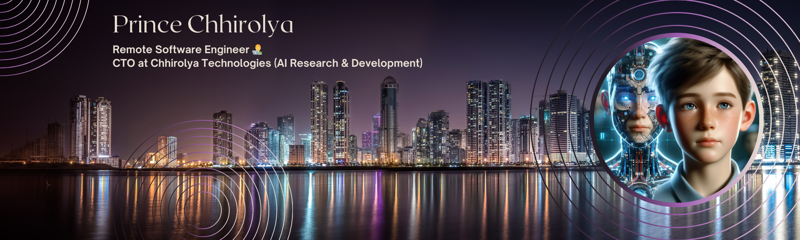

<!-- ╔══════════════════════════════════════════════════════════════════╗ -->
<!-- ║   ⚡ PRINCE CHHIROLYA · GitHub Profile README ⚡ ║ -->
<!-- ╚══════════════════════════════════════════════════════════════════╝ -->

<h1 align="center"><i> Hello!, fellow < Programmers/ > I'm Prince👋 </i></h1>

_Hi! 👋, My name is **Prince Chhirolya** and I'm currently working remotely as a **Remote Software Engineer** from India 👨‍💻. I also work on my dream project, **Chhirolya Technologies** (AI Research & Development) ...🚀.
_

 

 

I am deeply passionate about leveraging technology to solve complex problems and drive innovation in the rapidly evolving landscape of software engineering. With a relentless drive for learning and growth, I continually expand my knowledge and hone my skills to stay at the forefront of technological advancements.

<!-- activity graph heroku-app start -->

    

<!-- activity graph heroku-app end -->

<b><i>Life is always...💖😊 More Learning 👨‍💻 ==> More Earning 💰 ==> More Happiness 🤗</i></b>

<!-- Skills & Tools -->

<h2 align="center">Skills & Tools: </h2>

<table align="center">
  <tr>
    <td align="center" width="45">
        
       Python
    </td>
    <td align="center" width="45">
        
       Java
    </td>
    <td align="center" width="45">
        
       JavaScript
    </td>
    <td align="center" width="45">
        
       React
    </td>
    <td align="center" width="45">
        
       HTML5
    </td>
    <td align="center" width="45">
        
       CSS3
    </td>
    <td align="center" width="45">
        
       TypeScript
    </td>
    <td align="center" width="45">
        
       Node.js
    </td>
    </td>
    <td align="center" width="45">
        
       Next.js
    </td>
    <td align="center" width="45">
        
       Express js
  </tr>

  <tr>
    <td align="center" width="45">
        
       SQL
    </td>
    <td align="center" width="45">
        
       Tailwind CSS
    </td>
    <td align="center" width="45">
        
       Material UI
    </td>
    <td align="center" width="45">
        
       Redux
    </td>
    <td align="center" width="45">
        
       npm
    </td>
    <td align="center" width="45">
        
       MySQL
    </td>
    <td align="center" width="45">
        
       MongoDB
    </td>
    </td>
    <td align="center" width="45">
        
       Redis
    </td>
    <td align="center" width="45">
        
       PostgreSQL
    </td>
    <td align="center" width="45">
        
       Cassandra
  </tr>
    
  <tr>
    <td align="center" width="45">
        
       VS Code
    </td>
    <td align="center" width="45">
        
       Git
    </td>
    <td align="center" width="45">
        
       Linux
    </td>
    <td align="center" width="45">
        
       Pycharm 
    </td>
    <td align="center" width="45">
        
       Webstrom 
    </td>
    <td align="center" width="45">
        
       Intellij
    </td>
    <td align="center" width="45">
        
       Postman
    </td>
    </td>
    <td align="center" width="45">
        
       Firebase
    </td>
    <td align="center" width="45">
        
       ChatGPT
    </td>
    <td align="center" width="45">
        
       GraphQL
  </tr>
    
 
  <tr>
    <td align="center" width="45">
        
       AWS Cloud
    </td>
    <td align="center" width="45">
        
       IBM Watson
    </td>
    <td align="center" width="45">
        
       Azure Cloud
    </td>
    <td align="center" width="45">
        
       Docker
    </td>
    <td align="center" width="45">
        
       Kubernetes
    </td>
    <td align="center" width="45">
        
       Teraform
    </td>
    <td align="center" width="45">
        
       Jenkins
    </td>
    </td>
    <td align="center" width="45">
        
       Notion
    </td>
    <td align="center" width="45">
        
       Miro
    </td>
    <td align="center" width="45">
        
       Rest API
  </tr>

    
  <tr>
    <td align="center" width="45">
        
       TensorFlow
    </td>
    <td align="center" width="45">
        
       OpenCV
    </td>
    <td align="center" width="45">
        
       Pytorch
    </td>
    <td align="center" width="45">
        
       Keras
    </td>
    <td align="center" width="45">
        
       Hugging Face
    </td>
    <td align="center" width="45">
        
       LangChain
    </td>
    <td align="center" width="45">
        
       Jira
    </td>
    <td align="center" width="45">
    </td>
    </td>
    <td align="center" width="45">
    <td align="center" width="45">
      
</tr>
</table>

 

<!-- Contact Us -->

<h2 align="center">You can connect with me on:🫂</h2>

  <a href="mailto:prince.chhirolya04@gmail.com" target="blank">
  <a href="https://linkedin.com/in/princechhirolya" target="blank">
  <a href="https://github.com/prince-chhirolya" target="blank">
  <a href="https://www.credly.com/users/prince-chhirolya/badges" target="blank">
  <a href="https://twitter.com/pr_chhirolya" target="blank">
  <a href="https://instagram.com/prince_chhirolya" target="blank">
  <a href="https://leetcode.com/chhirolyaprince/" target="blank">
  <a href="https://www.hackerrank.com/profile/chhirolyaprince" target="blank">
  <a href="https://learn.microsoft.com/en-us/users/prince-chhirolya/" target="blank">
  <a href="https://medium.com/@chhirolyaprince" target="blank"> 

 

 

