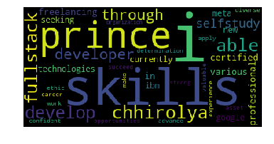

<!-- ╔══════════════════════════════════════════════════════════════════╗ -->
<!-- ║         ⚡ PRINCE CHHIROLYA · GitHub Profile README ⚡          ║ -->
<!-- ╚══════════════════════════════════════════════════════════════════╝ -->

<h1 align="center"><i>👋 Hello!, fellow &lt;Programmers /&gt; I'm Prince 🚀</i></h1>

  
  

**Founder & CEO** | **AI Researcher** | **Ex-Remote Software Engineer**  
**26× Certified Professional** | **Tech Community Leader** | **Programmers Worldwide (👨‍💻</>👩‍💻)**

I build, break, and secure AI systems — focusing on agents, RAG, and LLM infra — and ship solutions people actually use 😎

  I am currently focused on building my deep‑tech startup 
  <a href="https://www.linkedin.com/company/chhirolya-tech/" target="_blank"><b>Chhirolya Technologies</b></a> 
  (AI Research &amp; Development, specializing in defense and public sector). 
I also run a non‑profit organization
<a href="https://www.linkedin.com/company/maa-world/" target="_blank"><b>Maa World Foundation</b></a>
(free education, women &amp; child safety, and tech for social good).

  

<!-- 0101010101010101010101010101010101010101010101010101010101010101010101010101010101010101010101010 -->

# ♟️ Chhirolya's Open Chess Tournament - Let's Play!

**_Game is in progress._** This is an open chess tournament where ANYONE can play. That's the fun part.  
It's your turn to play! Move a <!-- BEGIN TURN -->white<!-- END TURN --> piece.

<!-- BEGIN CHESS BOARD -->
|   | A | B | C | D | E | F | G | H |   |
|---|:-:|:-:|:-:|:-:|:-:|:-:|:-:|:-:|:-:|
| **8** |  |  |  |  |  |  |  |  | **8** |
| **7** |  |  |  |  |  |  |  |  | **7** |
| **6** |  |  |  |  |  |  |  |  | **6** |
| **5** |  |  |  |  |  |  |  |  | **5** |
| **4** |  |  |  |  |  |  |  |  | **4** |
| **3** |  |  |  |  |  |  |  |  | **3** |
| **2** |  |  |  |  |  |  |  |  | **2** |
| **1** |  |  |  |  |  |  |  |  | **1** |
|   | **A** | **B** | **C** | **D** | **E** | **F** | **G** | **H** |   |
<!-- END CHESS BOARD -->

**It's your turn to move! Choose one from the following table**

<!-- BEGIN MOVES LIST -->
|  FROM  | TO (Just click a link!) |
| :----: | :---------------------- |
| **A1** | [A2](https://github.com/prince-chhirolya/prince-chhirolya/issues/new?body=Please+do+not+change+the+title.+Just+click+%22Submit+new+issue%22.+You+don%27t+need+to+do+anything+else+%3AD&title=Chess%3A+Move+A1+to+A2) |
| **A3** | [A4](https://github.com/prince-chhirolya/prince-chhirolya/issues/new?body=Please+do+not+change+the+title.+Just+click+%22Submit+new+issue%22.+You+don%27t+need+to+do+anything+else+%3AD&title=Chess%3A+Move+A3+to+A4) |
| **B1** | [C3](https://github.com/prince-chhirolya/prince-chhirolya/issues/new?body=Please+do+not+change+the+title.+Just+click+%22Submit+new+issue%22.+You+don%27t+need+to+do+anything+else+%3AD&title=Chess%3A+Move+B1+to+C3), [D2](https://github.com/prince-chhirolya/prince-chhirolya/issues/new?body=Please+do+not+change+the+title.+Just+click+%22Submit+new+issue%22.+You+don%27t+need+to+do+anything+else+%3AD&title=Chess%3A+Move+B1+to+D2) |
| **B2** | [B3](https://github.com/prince-chhirolya/prince-chhirolya/issues/new?body=Please+do+not+change+the+title.+Just+click+%22Submit+new+issue%22.+You+don%27t+need+to+do+anything+else+%3AD&title=Chess%3A+Move+B2+to+B3), [B4](https://github.com/prince-chhirolya/prince-chhirolya/issues/new?body=Please+do+not+change+the+title.+Just+click+%22Submit+new+issue%22.+You+don%27t+need+to+do+anything+else+%3AD&title=Chess%3A+Move+B2+to+B4) |
| **C1** | [D2](https://github.com/prince-chhirolya/prince-chhirolya/issues/new?body=Please+do+not+change+the+title.+Just+click+%22Submit+new+issue%22.+You+don%27t+need+to+do+anything+else+%3AD&title=Chess%3A+Move+C1+to+D2), [E3](https://github.com/prince-chhirolya/prince-chhirolya/issues/new?body=Please+do+not+change+the+title.+Just+click+%22Submit+new+issue%22.+You+don%27t+need+to+do+anything+else+%3AD&title=Chess%3A+Move+C1+to+E3), [F4](https://github.com/prince-chhirolya/prince-chhirolya/issues/new?body=Please+do+not+change+the+title.+Just+click+%22Submit+new+issue%22.+You+don%27t+need+to+do+anything+else+%3AD&title=Chess%3A+Move+C1+to+F4), [G5](https://github.com/prince-chhirolya/prince-chhirolya/issues/new?body=Please+do+not+change+the+title.+Just+click+%22Submit+new+issue%22.+You+don%27t+need+to+do+anything+else+%3AD&title=Chess%3A+Move+C1+to+G5), [H6](https://github.com/prince-chhirolya/prince-chhirolya/issues/new?body=Please+do+not+change+the+title.+Just+click+%22Submit+new+issue%22.+You+don%27t+need+to+do+anything+else+%3AD&title=Chess%3A+Move+C1+to+H6) |
| **C2** | [C3](https://github.com/prince-chhirolya/prince-chhirolya/issues/new?body=Please+do+not+change+the+title.+Just+click+%22Submit+new+issue%22.+You+don%27t+need+to+do+anything+else+%3AD&title=Chess%3A+Move+C2+to+C3), [C4](https://github.com/prince-chhirolya/prince-chhirolya/issues/new?body=Please+do+not+change+the+title.+Just+click+%22Submit+new+issue%22.+You+don%27t+need+to+do+anything+else+%3AD&title=Chess%3A+Move+C2+to+C4) |
| **D1** | [D2](https://github.com/prince-chhirolya/prince-chhirolya/issues/new?body=Please+do+not+change+the+title.+Just+click+%22Submit+new+issue%22.+You+don%27t+need+to+do+anything+else+%3AD&title=Chess%3A+Move+D1+to+D2), [D3](https://github.com/prince-chhirolya/prince-chhirolya/issues/new?body=Please+do+not+change+the+title.+Just+click+%22Submit+new+issue%22.+You+don%27t+need+to+do+anything+else+%3AD&title=Chess%3A+Move+D1+to+D3), [D4](https://github.com/prince-chhirolya/prince-chhirolya/issues/new?body=Please+do+not+change+the+title.+Just+click+%22Submit+new+issue%22.+You+don%27t+need+to+do+anything+else+%3AD&title=Chess%3A+Move+D1+to+D4), [D5](https://github.com/prince-chhirolya/prince-chhirolya/issues/new?body=Please+do+not+change+the+title.+Just+click+%22Submit+new+issue%22.+You+don%27t+need+to+do+anything+else+%3AD&title=Chess%3A+Move+D1+to+D5), [D6](https://github.com/prince-chhirolya/prince-chhirolya/issues/new?body=Please+do+not+change+the+title.+Just+click+%22Submit+new+issue%22.+You+don%27t+need+to+do+anything+else+%3AD&title=Chess%3A+Move+D1+to+D6), [D7](https://github.com/prince-chhirolya/prince-chhirolya/issues/new?body=Please+do+not+change+the+title.+Just+click+%22Submit+new+issue%22.+You+don%27t+need+to+do+anything+else+%3AD&title=Chess%3A+Move+D1+to+D7) |
| **E1** | [D2](https://github.com/prince-chhirolya/prince-chhirolya/issues/new?body=Please+do+not+change+the+title.+Just+click+%22Submit+new+issue%22.+You+don%27t+need+to+do+anything+else+%3AD&title=Chess%3A+Move+E1+to+D2) |
| **E2** | [E3](https://github.com/prince-chhirolya/prince-chhirolya/issues/new?body=Please+do+not+change+the+title.+Just+click+%22Submit+new+issue%22.+You+don%27t+need+to+do+anything+else+%3AD&title=Chess%3A+Move+E2+to+E3), [E4](https://github.com/prince-chhirolya/prince-chhirolya/issues/new?body=Please+do+not+change+the+title.+Just+click+%22Submit+new+issue%22.+You+don%27t+need+to+do+anything+else+%3AD&title=Chess%3A+Move+E2+to+E4) |
| **E5** | [E6](https://github.com/prince-chhirolya/prince-chhirolya/issues/new?body=Please+do+not+change+the+title.+Just+click+%22Submit+new+issue%22.+You+don%27t+need+to+do+anything+else+%3AD&title=Chess%3A+Move+E5+to+E6) |
| **F2** | [F3](https://github.com/prince-chhirolya/prince-chhirolya/issues/new?body=Please+do+not+change+the+title.+Just+click+%22Submit+new+issue%22.+You+don%27t+need+to+do+anything+else+%3AD&title=Chess%3A+Move+F2+to+F3), [F4](https://github.com/prince-chhirolya/prince-chhirolya/issues/new?body=Please+do+not+change+the+title.+Just+click+%22Submit+new+issue%22.+You+don%27t+need+to+do+anything+else+%3AD&title=Chess%3A+Move+F2+to+F4) |
| **G1** | [F3](https://github.com/prince-chhirolya/prince-chhirolya/issues/new?body=Please+do+not+change+the+title.+Just+click+%22Submit+new+issue%22.+You+don%27t+need+to+do+anything+else+%3AD&title=Chess%3A+Move+G1+to+F3), [H3](https://github.com/prince-chhirolya/prince-chhirolya/issues/new?body=Please+do+not+change+the+title.+Just+click+%22Submit+new+issue%22.+You+don%27t+need+to+do+anything+else+%3AD&title=Chess%3A+Move+G1+to+H3) |
| **G2** | [G3](https://github.com/prince-chhirolya/prince-chhirolya/issues/new?body=Please+do+not+change+the+title.+Just+click+%22Submit+new+issue%22.+You+don%27t+need+to+do+anything+else+%3AD&title=Chess%3A+Move+G2+to+G3), [G4](https://github.com/prince-chhirolya/prince-chhirolya/issues/new?body=Please+do+not+change+the+title.+Just+click+%22Submit+new+issue%22.+You+don%27t+need+to+do+anything+else+%3AD&title=Chess%3A+Move+G2+to+G4) |
| **H2** | [H3](https://github.com/prince-chhirolya/prince-chhirolya/issues/new?body=Please+do+not+change+the+title.+Just+click+%22Submit+new+issue%22.+You+don%27t+need+to+do+anything+else+%3AD&title=Chess%3A+Move+H2+to+H3), [H4](https://github.com/prince-chhirolya/prince-chhirolya/issues/new?body=Please+do+not+change+the+title.+Just+click+%22Submit+new+issue%22.+You+don%27t+need+to+do+anything+else+%3AD&title=Chess%3A+Move+H2+to+H4) |
<!-- END MOVES LIST -->

Having fun? Ask a friend to do the next move!

#### How it works

When you click on a link and submit a new issue with the desired move, a GitHub action is triggered, which in turn runs a small python script that performs the specified movement, updates this README file and commits the changes.

Have you spotted a bug? Something missing? Feel free to open an [issue](https://github.com/prince-chhirolya/prince-chhirolya/issues) and I will try to fix it as soon as possible :D

  
Last 5 moves in this game

<!-- BEGIN LAST MOVES -->

| Move | Author |
| :--: | :----- |
| `H7` to `H6` | [ @prince-chhirolya](https://github.com/prince-chhirolya) |
| `D4` to `E5` | [ @shivi-sharma123](https://github.com/shivi-sharma123) |
| `E7` to `E8` | [ @prince-chhirolya](https://github.com/prince-chhirolya) |
| `D3` to `D4` | [ @shivi-sharma123](https://github.com/shivi-sharma123) |
| `E8` to `E7` | [ @prince-chhirolya](https://github.com/prince-chhirolya) |

<!-- END LAST MOVES -->

  
Top 10 most moves across all games

<!-- BEGIN TOP MOVES -->

| Total moves |  User  |
| :---------: | :----- |
| 4 | [@shivi-sharma123](https://github.com/shivi-sharma123) |
| 4 | [@prince-chhirolya](https://github.com/prince-chhirolya) |

<!-- END TOP MOVES -->

---

<!-- 0101010101010101010101010101010101010101010101010101010101010101010101010101010101010101010101010 -->

## 🤝 Let’s Build Something Spicy

Open to **collabs, consulting**
Ping me — let’s build cool (and safe) shit together.

  &nbsp;
  &nbsp;
  &nbsp;
  &nbsp;
    &nbsp;
  

  

<b><i>Life is always... 💖😊 More Learning 👨‍💻 ➡️ More Earning 💰 ➡️ More Happiness 🤗</i></b>

<!-- My Projects add soon-->

<h2>My Projects & Communities 🚀</h2>

✌️ Chhirolya Technologies (CT)
  <ol>
    <li> <a href="#" target="_blank">Karnika - AIOS</a> -- Description add soon...</li>
    <li> <a href="#" target="_blank">SPY WING - DEFENSE_MATRIX</a> -- Description add soon...</li>
    <li> <a href="#" target="_blank">View.IN - AIOS</a> -- Description add soon...</li>
    <li> <a href="#" target="_blank">Chhirolya Research</a> -- Description add soon...</li>
  </ol>
✌️ Maa World Foundation (MWF) 
  <ol>
    <li> <a href="#" target="_blank">Programmers Worldwide Community</a> -- Description add soon...</li>
    <li> <a href="#" target="_blank">Learn First Program Global</a> -- Description add soon...</li>
    <li> <a href="#" target="_blank">Learn First Program [IN] Chapter</a> -- Description add soon...</li>
    <li> <a href="#" target="_blank">Aashayein Community</a> -- Description add soon...</li>
  </ol>
✌️ Open Source Projects
  <ol>
    <li> [CT] <a href="#" target="_blank">SkyRocket DevHub < / > </a> -- Description add soon...</li>
    <li> [CT x MWF] <a href="#" target="_blank">Kisan.IN - AI Farmer's Companion
    </a> -- Description add soon...</li>
    <li> * <a href="#" target="_blank">Right - CT Challenge</a> -- Description add soon...</li>
  </ol>
✌️ Personal Projects
  <ol>
    <li> <a href="#" target="_blank">Project 1</a> -- Description add soon...</li>
    <li> <a href="#" target="_blank">Project 2</a> -- Description add soon...</li>
    <li> <a href="#" target="_blank">Project 3</a> -- Description add soon...</li>
  </ol>

## 🛠️My Skills & Tools

### 💻 Languages & Frameworks

|  Python |  Java |  JavaScript |  TypeScript |  HTML5 |  CSS3 |
| :----------------------------------------------------------------------------------------------------------------------: | :-------------------------------------------------------------------------------------------------------------: | :--------------------------------------------------------------------------------------------------------------------: | :--------------------------------------------------------------------------------------------------------------------------: | :-------------------------------------------------------------------------------------------: | :------------------------------------------------------------------------------------: |

|  React |  Next.js |  Node.js |  Express.js |  Tailwind CSS |  Material UI |
| :----------------------------------------------------------------------------------------: | :-------------------------------------------------------------------------------------------: | :-----------------------------------------------------------------------------------------------------: | :--------------------------------------------------------------------------------------------------------------------------: | :------------------------------------------------------------------------------------------------------: | :--------------------------------------------------------------------------------------------------: |

### 🗄️ Databases & Backend

|  SQL |  MySQL |  MongoDB |  Redis |  PostgreSQL |  Cassandra |
| :-------------------------------------------------------------------------------------------------------------------: | :---------------------------------------------------------------------------------------------------------------------: | :------------------------------------------------------------------------------------------------------------------------------------------------------------------------------------------------------------: | :------------------------------------------------------------------------------------------: | :-------------------------------------------------------------------------------------------------: | :-----------------------------------------------------------------------------------------------------------------------: |

### ☁️ Cloud, DevOps & Tools

|  AWS |  Azure |  Docker |  Kubernetes |  Terraform |  Jenkins |
| :--------------------------------------------------------------------------------------------------------------------------------------------------------: | :------------------------------------------------------------------------------------------: | :--------------------------------------------------------------------------------------------------------------------------------: | :------------------------------------------------------------------------------------------------: | :----------------------------------------------------------------------------------------------: | :------------------------------------------------------------------------------------------: |

|  Git |  Linux |  VS Code |  Postman |  Firebase |  REST API |
| :----------------------------------------------------------------------------------: | :---------------------------------------------------------------------------------------------------------------------: | :-----------------------------------------------------------------------------------------------------------------------: | :---------------------------------------------------------------------------------------------------------------------------------------------------------------------------------------------------------: | :-------------------------------------------------------------------------------------------------------------------------------------------------------------------------------------------------------------------------------------: | :-----------------------------------------------------------------------------------------------------: |

|  Redux |  GraphQL |  npm |  Notion |  Miro |  Jira |
| :--------------------------------------------------------------------------------------: | :--------------------------------------------------------------------------------------------------------------------------------------------------------------------------------------------------------------------: | :---------------------------------------------------------------------------------------------------------------------------: | :--------------------------------------------------------------------------------------------------------------------------------------------------------: | :----------------------------------------------------------------------------------------------------------------------------------------: | :------------------------------------------------------------------------------------: |

### 🤖 AI / ML & Research

|  TensorFlow |  PyTorch |  Keras |  OpenCV |  Hugging Face |  LangChain |
| :----------------------------------------------------------------------------------------------------------------------------------------------: | :-------------------------------------------------------------------------------------------------------------------------------: | :---------------------------------------------------------------------------------------------------------------: | :------------------------------------------------------------------------------------------------------------------------------: | :------------------------------------------------------------------------------------------------------------------------------------: | :---------------------------------------------------------------------------------------------------------------------------------------------------------------------: |

|  IBM Watson |  PyCharm |  WebStorm |  IntelliJ |  ChatGPT |     |
| :-------------------------------------------------------------------------------------------------: | :----------------------------------------------------------------------------------------------: | :--------------------------------------------------------------------------------------------: | :-------------------------------------------------------------------------------------------------: | :---------------------------------------------------------------------------------------------------------------------------------------------------------: | :-: |

---

<!-- 

  

 -->
